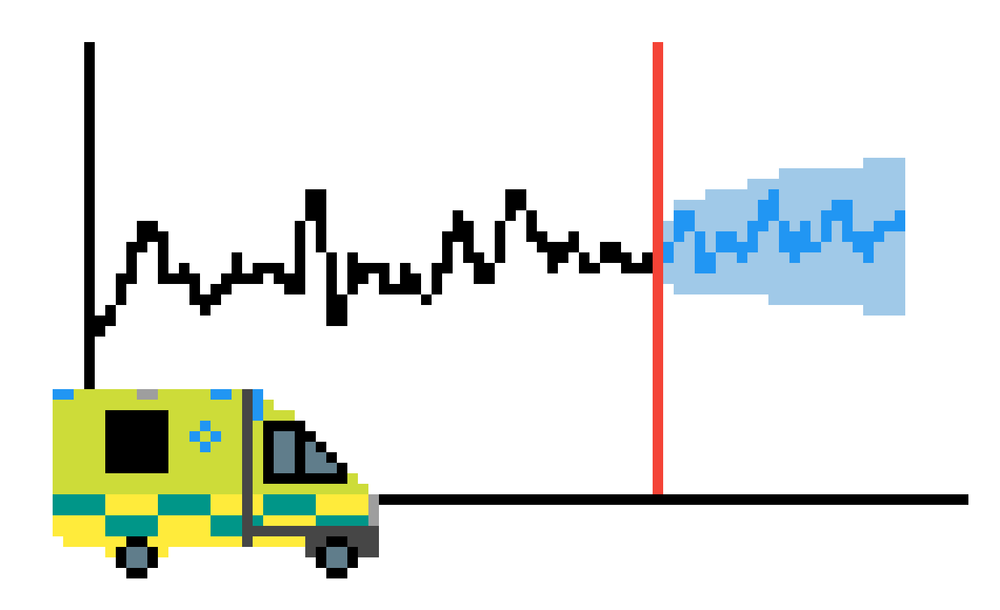

# ambforecast: open reproducible forecasts of ambulance incidents, calls and responses

<!-- ALL-CONTRIBUTORS-BADGE:START - Do not remove or modify this section -->
[](#contributors-)
<!-- ALL-CONTRIBUTORS-BADGE:END -->

Documentation: <https://ambmodels.github.io/ambforecast/>



<br>

## Setup

Dependencies are listed in `pyproject.toml`. These can be installed using Python 3.13 and your preferred environment manager.

### Mamba

```bash
mamba create -n ambforecast python=3.13
mamba activate ambforecast
pip install -e .
```

### venv

On Windows:

```bash
py -3.13 -m venv .venv
.\venv\Scripts\activate
pip install -e .
```

On Linux or macOS:

```bash
python3.13 -m venv .venv
source .venv/bin/activate
pip install -e .
```

### Poetry

```bash
poetry env use 3.13
poetry install
poetry shell
```

### uv

```bash
uv venv --python 3.13
source .venv/bin/activate
pip install -e .
```

<br>

## Using ambforecast

This repository contains the open-source forecasting code and simple examples showing how to use its main functions.

Making the code open supports transparency, reproducibility, and reuse. It allows others to understand how the forecasts are produced, test and improve the methods, and adapt them for other ambulance services or similar forecasting problems.

The full analysis using real ambulance service data is carried out in the separate private `ambforecast-private` repository. Private analysis outputs are not included here.

<br>

## Pre-commit

This repository includes a pre-commit hook that checks for the filename of real (private) data, which should never be used here. That analysis belongs in a separate, private repository. If you've accidentally referenced the real data file name in a staged file, the hook will detect it and block the commit, prompting you to remove it before processing.

To activate this hook after cloning this repository, run:

```
pre-commit install
```

<br>

## Documentation

The documentation is rendered and published on GitHub pages via GitHub actions. You can view it at: <https://ambmodels.github.io/ambforecast/>

However, if you would like to render it locally, you can run:

```
great-docs build
great-docs preview
```

<br>

## Linting and formatting

This project uses `ruff` to keep Python code consistent and catch common issues. It's settings are stored in `pyproject.toml`. Run the following commands from the project root to format Python files (`.py`) and notebooks (`.ipynb`). It will automatically fix any linting and formatting issues where possible.

```
ruff format
ruff check --fix
lintquarto
```

<br>

## Citation

If you use this repository, please cite us:

> Heather, A., Coulson, L., Irungu, I., & Monks, T. ambforecast: open reproducible forecasts of ambulance incidents, calls and responses [Computer software]. https://github.com/ambmodels/ambdes

<br>

## Contributors ✨

TODO: Add Irene once receive GitHub username.

Thanks goes to these wonderful people ([emoji key](https://allcontributors.org/docs/en/emoji-key)):

<!-- ALL-CONTRIBUTORS-LIST:START - Do not remove or modify this section -->
<!-- prettier-ignore-start -->
<!-- markdownlint-disable -->
<table>
  <tbody>
    <tr>
      <td align="center" valign="top" width="14.28%"><a href="https://www.linkedin.com/in/amyheather"><br /><sub><b>Amy Heather</b></sub></a><br /><a href="https://github.com/ambmodels/ambforecast/commits?author=amyheather" title="Code">💻</a></td>
      <td align="center" valign="top" width="14.28%"><a href="https://experts.exeter.ac.uk/19244-thomas-monks"><br /><sub><b>Tom Monks</b></sub></a><br /><a href="https://github.com/ambmodels/ambforecast/commits?author=TomMonks" title="Code">💻</a></td>
      <td align="center" valign="top" width="14.28%"><a href="https://github.com/LeeCoulsonNHS"><br /><sub><b>LeeCoulsonNHS</b></sub></a><br /><a href="https://github.com/ambmodels/ambforecast/commits?author=LeeCoulsonNHS" title="Code">💻</a> <a href="#data-LeeCoulsonNHS" title="Data">🔣</a> <a href="#ideas-LeeCoulsonNHS" title="Ideas, Planning, & Feedback">🤔</a></td>
      <td align="center" valign="top" width="14.28%"><a href="https://www.linkedin.com/in/robchallen"><br /><sub><b>Rob Challen</b></sub></a><br /><a href="#ideas-robchallen" title="Ideas, Planning, & Feedback">🤔</a></td>
    </tr>
  </tbody>
</table>

<!-- markdownlint-restore -->
<!-- prettier-ignore-end -->

<!-- ALL-CONTRIBUTORS-LIST:END -->

This project follows the [all-contributors](https://github.com/all-contributors/all-contributors) specification. Contributions of any kind welcome!

<br>

## Acknowledgements

This work is part of the [STARS project](https://pythonhealthdatascience.github.io/stars/), supported by the Medical Research Council [grant number MR/Z503915/1] 

This repository builds on the work reported in:

> Monks, T., Harper, A., Allen, M. et al. Forecasting the daily demand for emergency medical ambulances in England and Wales: a benchmark model and external validation. BMC Med Inform Decis Mak 23, 117 (2023). https://doi.org/10.1186/s12911-023-02218-z.

The GitHub repositories from that publication are <https://github.com/TomMonks/swast-benchmarking> and <https://github.com/TomMonks/swast-forecast-tool>.
